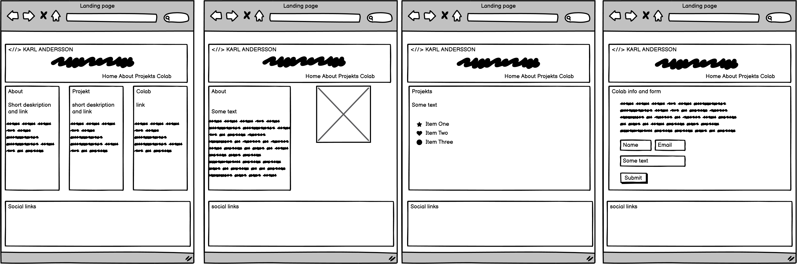
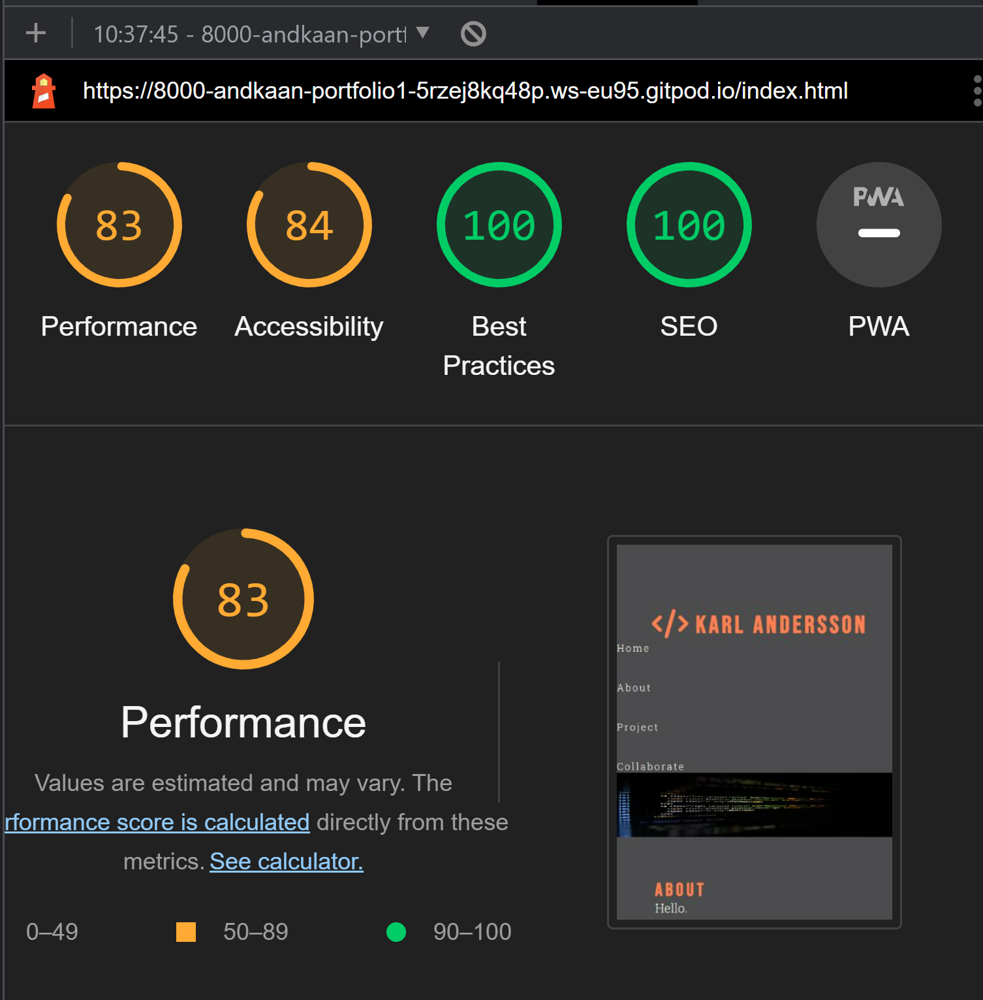

<dDOCKTYPE md>
<html>
<head>
        <meta charset="UTF-8">
        <title>Karl Andersson Resume Page</title>

       
</head>
<body>

<h1>Karl Andersson Resume Page</h1>

<h2>Idea</h2>

Draft from Balsamiq based on a resume page containing a landing page with liks to About, Projekts, collaboration. The footer has fontawsome no grouted links as i dont have any social media.
 

<h2>Implementation</h2>
Whit balsamiq and love runing as a base i started to code whit Gitpod and localy om VSC for reference.
The design change a bit from balsamiq do to laking of skils. 

<h2>Truble end Errors</h2>
Had some truble whit menu and size in smaler skrean sizes,
the fix whas to contact tutors that pointed me to Love runing. 

<h2>Preformence</h2>

<h2>Valdilation html</h2>

<h2>Valdilation css</h2>

<h2>Credits</h2>
Hero image from pixels.com
Code Institute Love Runing project for insperation. 
WW3 Scool 
Youtube.com
Fontawsome.com 
Googlefonts 

<h2>Licence</h2>
No Licens neded 

</body>
</html>